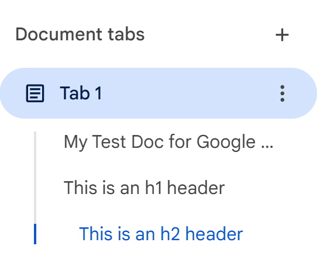

This is a test of non-text content placed in the middle of or between code blocks.

    This is a code block with an image inside.

    And some more code block text after the image.

And now some more normal text.
